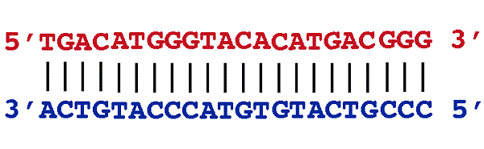

**Difficoltà: _4_**

## Descrizione del problema
Negli ultimi due decenni, la biologia è diventata una nuova fonte di Big Data a causa delle nuove tecnologie di sequenziamento di DNA. Nel $2003$, il completamento del *progetto genoma umano* ha permesso agli scienziati di ricostruire approssimativamente il DNA della specie umana: una lunga sequenza (stringa) composta da lettere $A,C,G,T$ (Adenina, Citosina, Guanina, Timina).
Il passo successivo a questo importante traguardo è quello di ricostruire il DNA di singole persone. 
Luigi e Nicola sono i due nuovi data scientist assunti dalla Watson SpA. Il loro compito è di ricostruire la sequenza di DNA di Luigi usando gli strumenti a disposizione in laboratorio. Per prima cosa, i due scienziati estratto del DNA dal bulbo di un capello di Luigi; dopodichè, lo hanno dato in pasto ai *sequenziatori* in laboratorio: macchine in grado di "leggere" il DNA. I rudimentali sequenziatori del laboratorio, però, riescono a "leggere" sequenze lunghe al massimo $20$ lettere. Gli scienziati hanno quindi dovuto organizzare una sorta di "puzzle":

1. Hanno creato diverse copie del  DNA di Luigi,
2. Hanno spezzettato queste copie in pezzettini di lunghezza al più $20$,
3. Hanno letto i pezzettini con un sequenziatore.



Dopo un po' di lavoro, gli scienziati sono finalmente riusciti a leggere una sequenza di $N$ pezzettini di DNA $P_1, P_2, . . . , P_N$ con queste proprietà:

* Per ogni $1\le i \lt j \le N$, il pezzettino $P_i$ è stato letto dal DNA di Luigi a partire da una posizione $p_i$ strettamente più a sinistra della posizione $p_j$ dalla quale è stato letto il pezzettino $P_j$ (ossia $p_i \lt p_j$ ).
* Ogni parte del DNA di Luigi è "coperta" da almeno un pezzettino.
* Pezzettini consecutivi possono accavallarsi in ogni modo, o possono non accavallarsi affatto.

Aiuta i due scienziati a ricostruire la sequenza di DNA *più corta* dalla quale i pezzettini possono essere stati estratti.


## Dati di Input

La prima riga del file di input contiene un intero $T$, il numero di testcase. 
Le successive righe mostrano i $T$ testcase in ordine. Ogni testcase è composto da $N+1$ righe. La prima riga contiene l’intero $N$, il numero di pezzettini di DNA letti dal sequenziatore. Le successive $N$ righe contengono gli $N$ pezzettini $P_1, . . . , P_N$ (ossia, stringhe di lunghezza al più $20$ sull'alfabeto {$A, C, G, T$}).

## Dati di Output
Il file di output deve essere composto da $T$ righe, ciascuna delle quali contenente la dicitura ```Case #x: y``` dove `x` è il numero del testcase (a partire da $1$) e `y` è la lunghezza della sequenza di DNA più corta compatibile con gli $N$ pezzettini in input.

## Assunzioni
* $1 \le T \le 20$
* $1 \le N \le 10000$
* $|P_i| \le 20$ ($|P_i|$ è la lunghezza dell’*i*-esimo pezzettino).

## Esempi di input/output

***

**Input:**
```
2
6
AAACTACGACT
ACTAC
ACGACTAC
ACTACGG
CGGA
TTG
4
GATGAT
GATGTT
ATGT
GTTT
```

***

**Output:**
```
Case #1: 19
Case #2: 10
```

***
## Spiegazione

*Case #1*:
Nel primo esempio mostrato, l’allineamento ottimale dei pezzettini è:

```
AAACTACGACT
  ACTAC
     ACGACTAC
        ACTACGG
            CGGA
                TTG
```

e la sequenza risultante è quindi AAACTACGACTACGGATTG, di lunghezza $19$. Notare che esistono pezzettini completamente "inglobati" da altri pezzettini e che due pezzettini consecutivi non devono necessariamente accavallarsi.

*Case #2*:

Nel secondo esempio, l’allineamento ottimale dei pezzettini è:

```
GATGAT
   GATGTT
    ATGT
      GTTT
```

e la sequenza risultante è quindi GATGATGTTT, di lunghezza $10$.
